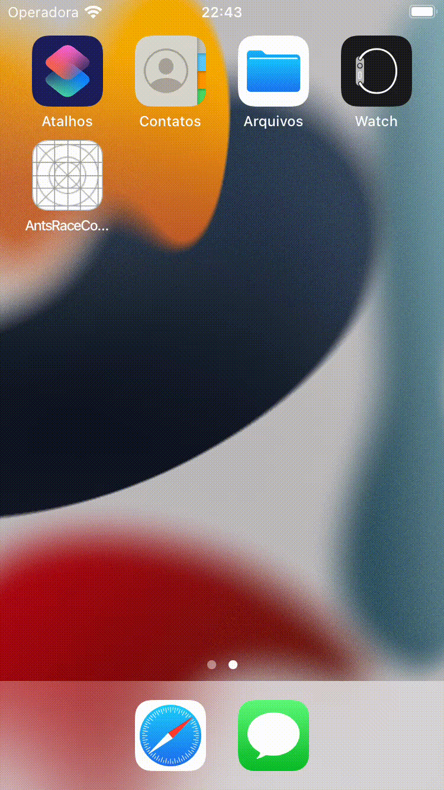

# Ants Race Code Challenge
Calculate likelihood of win for ants race.


## Demo




## Run Locally

Clone the project
```bash
  git clone https://github.com/PHtorres/react-native-ants-race-code-challenge.git
```


Install dependencies
```bash
  npm install
```

IOS extra step
```bash
  cd ios
  pod install
```

Android
```bash
  npx react-native run-android
```

IOS
```bash
  npx react-native run-ios
```


## Tech Stack

- React
- React Native
- Typescript
- Zustand
- Axios


## Authors

- [@PHTorres](https://www.github.com/phtorres)


## 🚀 About Me
* 🌍  I'm based in Rio de Janeiro, Brazil
* ✉️  You can contact me at [paulohenriquetorresdev@gmail.com](mailto:paulohenriquetorresdev@gmail.com)
* 🚀  I'm currently working on [Codelitt](https://www.codelitt.com/)
* 🧠  I'm learning Swift for IOS native apps.
* 🤝  I'm open to collaborating on projects that have a high impact in peoples lives using React, React Native or .NET platforms.

